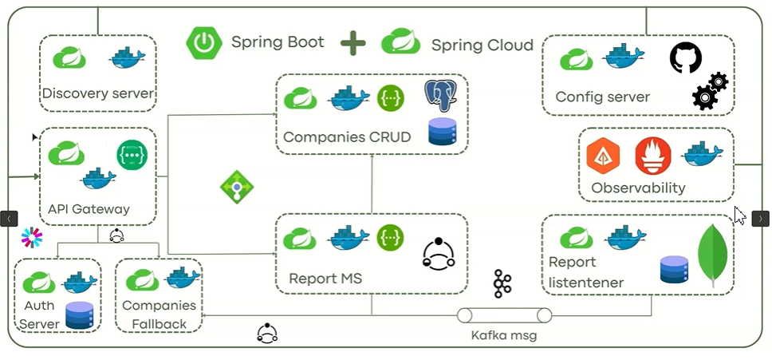

# 🚀 Spring Cloud Microservices Architecture

Bienvenido al proyecto de arquitectura de microservicios usando **Spring Boot** y **Spring Cloud** ✨. Este ecosistema simula un entorno empresarial moderno con servicios desacoplados, alta disponibilidad, resiliencia y observabilidad.

---

## 🌐 Tecnologías principales

| Componente            | Tecnología                                   |
|-----------------------|-----------------------------------------------|
| Backend base          | Spring Boot 👨‍💻                          |
| Microservicios        | Spring Cloud ✨                             |
| Balanceo de carga     | Eureka + Ribbon (Client-side load balancing) |
| Gateway               | Spring Cloud Gateway 🏡                   |
| Resiliencia           | Resilience4j (Circuit Breaker) 🔄        |
| Observabilidad        | Zipkin + Prometheus + Grafana 🌍           |
| Configuración central | Spring Cloud Config Server ⚙️             |
| Mensajería            | Apache Kafka 📢                            |
| Autenticación         | OAuth2 + Auth Server 🔐                  |

---

## 🧳 Microservicios principales

### 🏢 API Gateway
- Entrada única al sistema
- Enrutamiento dinámico
- Soporte para circuit breaker y fallback

### 📉 Companies CRUD
- Servicio principal para la gestión de compañías
- Conectado a base de datos PostgreSQL
- Publica eventos en Kafka al crear/modificar datos

### 🧠 Companies Fallback
- Se activa cuando Companies CRUD falla
- Devuelve una compañía por defecto o cacheada

### 📊 Report Listener
- Escucha eventos de Kafka y genera reportes
- Guarda en MongoDB

### 🎓 Auth Server
- Proveedor de tokens JWT con OAuth2
- Protege el acceso a los microservicios

### 🌍 Discovery Server
- Implementado con Eureka
- Permite que los servicios se descubran entre sí

### 📈 Observability Stack
- Zipkin: trazabilidad distribuida
- Prometheus: monitoreo de métricas
- Grafana: visualización de dashboards

### 🔧 Config Server
- Centraliza y versiona los archivos `application.yml`
- Integrado con GitHub 💾

---

## 🧡 Características destacadas

- ✅ Arquitectura basada en microservicios desacoplados
- ⚖️ Load balancing client-side (Ribbon + Eureka)
- 🔄 Circuit breaker con fallback usando Resilience4j
- 📈 Observabilidad total con Zipkin y Prometheus
- 📢 Streaming de eventos con Kafka
- 🔐 Seguridad basada en OAuth2 + JWT
- ⚙️ Configuración centralizada y externalizada

---

## 🚗 Ejecución del proyecto

1. Clonar el repo y asegurarse de tener Docker y Java 17+  
2. Levantar infraestructura con `docker-compose up`  
3. Ejecutar los servicios en este orden:
    - `discovery-server`
    - `config-server`
    - `gateway`
    - `companies-crud`
    - `companies-fallback`
    - `report-listener`
    - `auth-server`
4. Acceder al sistema desde:
    - Gateway: [http://localhost:4040](http://localhost:4040)
    - Eureka: [http://localhost:8761](http://localhost:8761)
    - Zipkin: [http://localhost:9411](http://localhost:9411)
    - Grafana: [http://localhost:3000](http://localhost:3000)

---

## 🚀 Contribuciones

¡Las contribuciones son bienvenidas! Puedes abrir un PR o crear un issue si encuentras algo por mejorar.

---

## 🚀 Crédito

Este proyecto es parte de un laboratorio de arquitectura moderna con Spring Cloud y Kafka desarrollado con fines educativos y profesionales.
